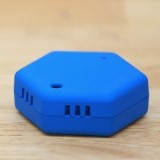

WxBeacon
========

[](https://developer.apple.com/iphone/index.action)
[](https://developer.apple.com/swift)
[](http://mit-license.org)


概要
------
WxBeacon は気温、湿度、気圧を観測し、iBeacon の仕組みを利用して送信するデバイスです。  
本ライブラリは、iOS端末で WxBeacon のデータを受信して画面に観測値を表示するサンプルコードです。  
WxBeacon はウェザーニュースタッチの有料会員のうち、ウェザーリポート送信などで 2000pt を達成した方にプレゼントしています。  



Requirement
--------
iOS 8.0以降、Bluetooth, 位置情報の利用許可が必要です。  
(WxBeacon の受信自体はiOS 7.0以降で可能ですが、本サンプルではエラー表示にUIAlertController を使用しているため、iOS 8.0以降を対象としています。)  
本サンプルコードは Xcode 8.2.1, iOS 10.2.1 で動作確認を行っています。


How to use
--------
* `WxBeaconData.swift` と `WxBeaconMonitor.swift` をあなたのXcode のproject にコピーしてください。
* Info.plist に `NSLocationAlwaysUsageDescription` の項目を追加してください。String の値は空欄でも良いです。
* データ表示を行いたいclass で、WxBeaconMonitorDelegate protocol に沿って実装してください。
* 下記のように WxBeaconMonitor を初期化してください。
```swift
let beaconMonitor = WxBeaconMonitor()
beaconMonitor.delegate = self
beaconMonitor.startMonitoring(true)
```
* WxBeacon の値を受信すると、```func didUpdateWeatherData(_ data: WxBeaconData?)``` が呼び出されます。
* エラーがあった場合は ```func showAlert(_ message: String)``` が呼ばれます。
* `startMonitoring()` の引数を `true` にした場合、アプリがバックグラウンドにいても beacon の受信を続けます。